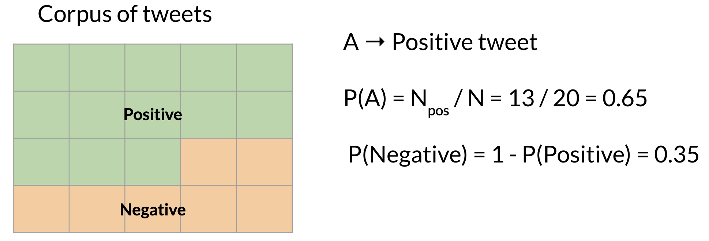
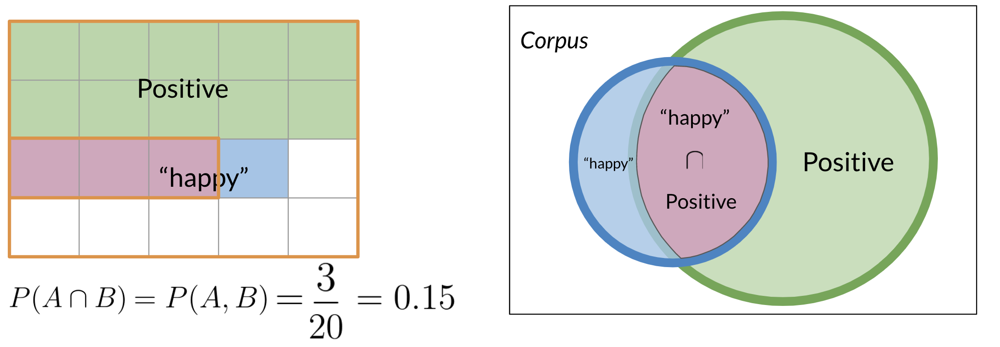
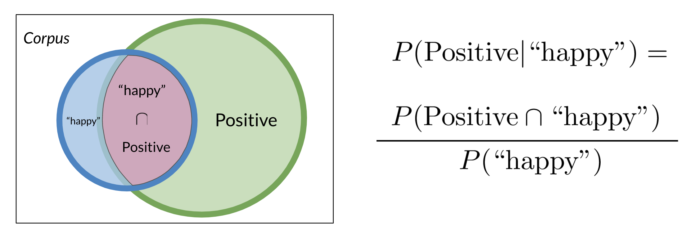
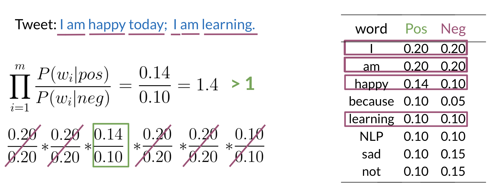
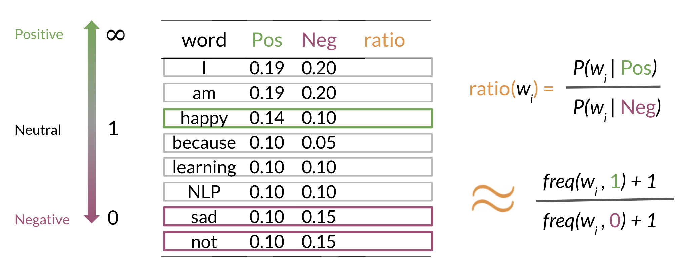

# Week 2

## 1. Probability and Bayes’ Rule

You learned about probabilities and Bayes' rule. 

<p align="left">

</p>

To calculate a probability of a certain event happening, you take the count of that specific event and you divide by the sum of all events. Furthermore, the sum of all probabilities has to equal 1. 

<p align="left">

</p>

To compute the probability of 2 events happening, like "happy" and "positive" in the picture above, you would be looking at the intersection, or overlap of events. In this case red and blue boxes overlap in 3 boxes. So the answer is $\frac{3}{20}$.


## 2. Bayes' Rule

Conditional probabilities help us reduce the sample search space. For example given a specific event already happened, i.e. we know the word is happy:


<p align="left">

</p>

Then you would only search in the blue circle above. The numerator will be the red part and the denominator will be the blue part. This leads us to conclude the following: 

<p align="left">

</p>

Substituting the numerator in the right hand side of the first equation, you get the following: 

<p align="left">

</p>

Note that we multiplied by P(positive) to make sure we don't change anything.  That concludes Bayes Rule which is defined as:

P(X∣Y) = P(Y∣X)P(X) / P(Y)

$P(X|Y) = \frac{P(Y|X) P(X)}{P(Y)}$


## 3. Naïve Bayes Introduction

* It is "naïve" because it assumes that all the features for classification are independent (which in reality may not be)

* Still works nicely for sentiment analysis

To build a classifier, we will first start by creating conditional probabilities given the following table:

<p align="left">

</p>

* Note: The sum for "Neg" should also 13

This allows us compute the following table of probabilities:

<p align="left">

</p>

Once you have the probabilities, you can compute the likelihood score as follows:

<p align="left">

</p>

* The product formulae is the Naïve Bayes inference condition rule for binary classification

* The 1.4 calculation is for the word "happy"

* Words that have occurred equally in Pos and Neg do not have any effect on even new (unseen) sentences, even if those words occur a lot of time in the new unseen sentence.

A score greater than 1 indicates that the class is positive, otherwise it is negative.


## 4. Laplacian Smoothing

* Laplacian smoothing to avoid $P(wi | class) = 0$ case

We usually compute the probability of a word given a class as follows:

$P\left(\mathrm{w}_{\mathrm{i}} \mid \text { class }\right)=\frac{\text { freq }\left(\mathrm{w}_{\mathrm{i}}, \text { class }\right)}{\mathrm{N}_{\text {class }}} \quad \text { class } \in\{\text { Positive, Negative }\} $
 
```
P(w_i​ ∣ class ) = freq (w_i, class ) / N_class  
class ∈ { Positive, Negative }
```


However, if a word does not appear in the training, then it automatically gets a probability of 0, to fix this we add smoothing as follows

$P\left(\mathrm{w}_{\mathrm{i}} \mid \mathrm{class}\right)=\frac{\operatorname{freq}\left(\mathrm{w}_{\mathrm{i}}, \text { class }\right)+1}{\left(\mathrm{N}_{\text {class }}+\mathrm{V}\right)} $

```
P(w_i ∣ class) = freq(w_i, class) + 1 / (N_class + V)
```
​
Note that we added a 1 in the numerator, and since there are V words to normalize, we add V in the denominator. 

N_{class} : frequency of all words in class

V: number of unique words in vocabulary


## 5. Log Likelihood, Part 1

To compute the log likelihood, we need to get the ratios and use them to compute a score that will allow us to decide whether a tweet is positive or negative. The higher the ratio, the more positive the word is:

<p align="left">

</p>

To do inference, you can compute the following: 


$\frac{P(p o s)}{P(n e g)}  \prod_{i=1}^{m} \frac{P\left(w_{i} \mid p o s\right)}{P\left(w_{i} \mid n e g\right)}  >1 $

```
P(pos) / P(neg) ∏ i=1 to m [ P(w_i ∣ pos) / P(w_i ∣ neg) ] > 1
```

As m gets larger, we can get numerical flow issues, so we introduce the log, which gives you the following equation: 

$\log \left(\frac{P(p o s)}{P(n e g)} \prod_{i=1}^{n} \frac{P\left(w_{i} \mid p o s\right)}{P\left(w_{i} \mid n e g\right)}\right) \Rightarrow \log \frac{P(p o s)}{P(n e g)}+\sum_{i=1}^{n} \log \frac{P\left(w_{i} \mid p o s\right)}{P\left(w_{i} \mid n e g\right)}$

```
log [ P(pos) / P(neg) ∏ i=1 to n [P(w_i ∣ pos) / P(w_i ∣ neg) ] ] ⇒ log [ P(pos) / P(neg) ] + ∑ i=1 to n [ log P(w_i ∣ pos) / P(w_i ∣ neg) ]
```

The first component is called the log prior and the second component is the log likelihood. We further introduce λ as follows: 

<p align="left">

</p>

Having the λ dictionary will help a lot when doing inference.


## 6. Log Likelihood, Part 2

Once you computed the λ dictionary, it becomes straightforward to do inference: 

<p align="left">

</p>

As you can see above, since 3.3 > 0 , we will classify the document to be positive. If we got a negative number we would have classified it to the negative class.
