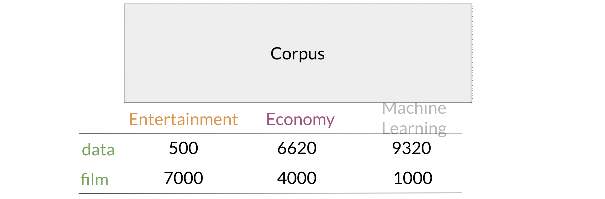
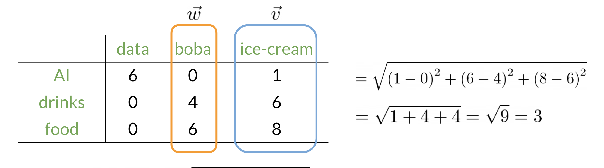

# Week 3

## 1. Vector Space Models

Vector spaces are fundamental in many applications in NLP. If you were to represent a word, document, tweet, or any form of text, you will probably be encoding it as a vector. These vectors are important in tasks like information extraction, machine translation, and chatbots. Vector spaces could also be used to help you identify relationships between words as follows: 

The famous quote by Firth says, "You shall know a word by the company it keeps". When learning these vectors, you usually make use of the neighbouring words to extract meaning and information about the centre word. If you were to cluster these vectors together, as you will see later in this specialization, you will see that adjectives, nouns, verbs, etc. tend to be near one another. Another cool fact, is that synonyms and antonyms are also very close to one another. This is because you can easily interchange them in a sentence and they tend to have similar neighbouring words!

## 2. Word by Word and Word by Doc

### Word by Word Design

* The idea is how many times every word occurs next the word data within a distance of k=2
  * For `I` it's `0` coz `I` is wayy too far from `data` in both sentences.

In the example above, you can see how we are keeping track of the number of times words occur together within a certain distance kk. At the end, you can represent the word data, as a vector $v = [2,1,1,0]$

### Word by Document Design

You can now apply the same concept and map words to documents. The rows could correspond to words and the columns to documents. The numbers in the matrix correspond to the number of times each word showed up in the document. 

You can represent the entertainment category, as a vector $v = [500, 7000]$. You can then also compare categories as follows by doing a simple plot.

## 3. Euclidean Distance

Let us assume that you want to compute the distance between two points: $A, B$. To do so, you can use the euclidean distance defined as:

$d(B, A) = \sqrt{(B_1 - A_1)^2 + (B_2 - A_2)^2}$

You can generalize finding the distance between the two points $(A,B)$ to the distance between an nn dimensional vector as follows: 

$d(\vec{v}, \vec{w}) = \sqrt{\sum_{i=1}^{n}{(v_i - w_i)^2}}$

Here is an example where I calculate the distance between 2 vectors $(n = 3)$.

